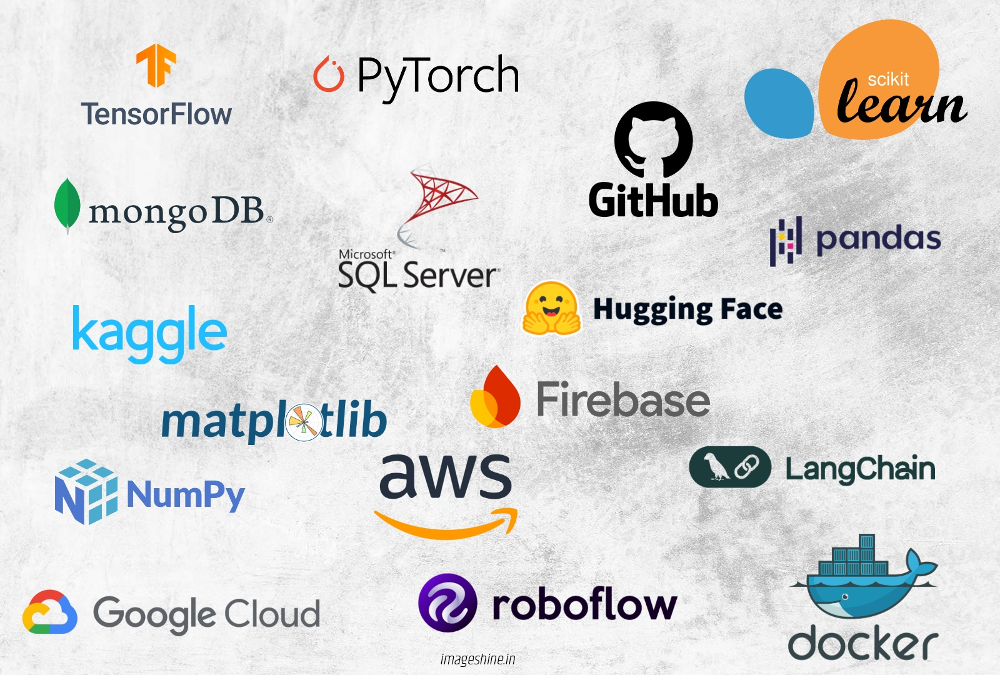
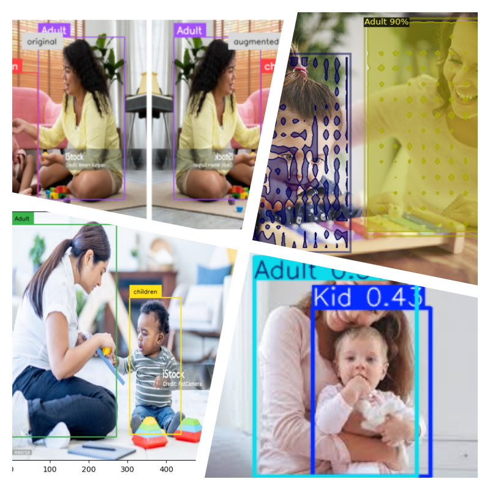
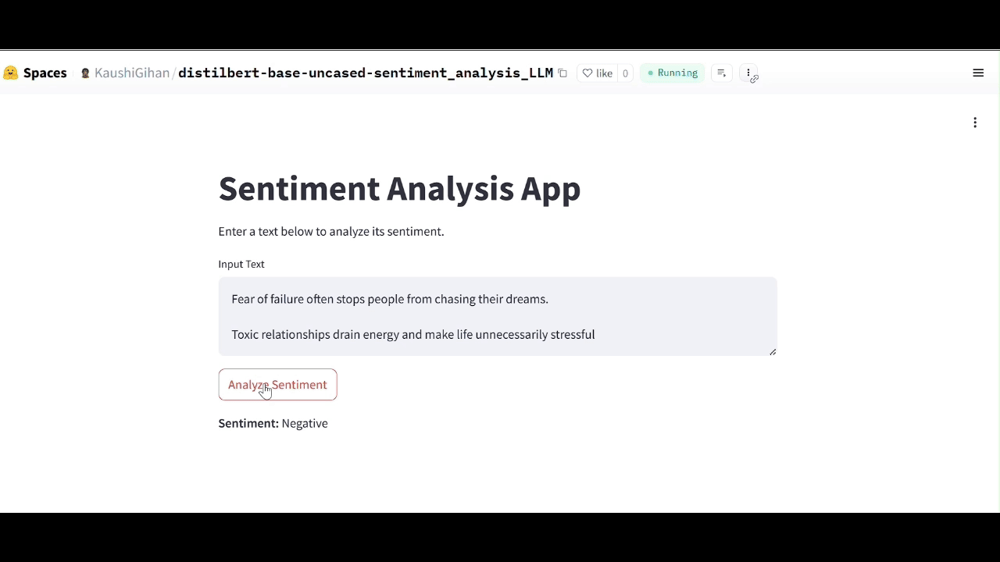
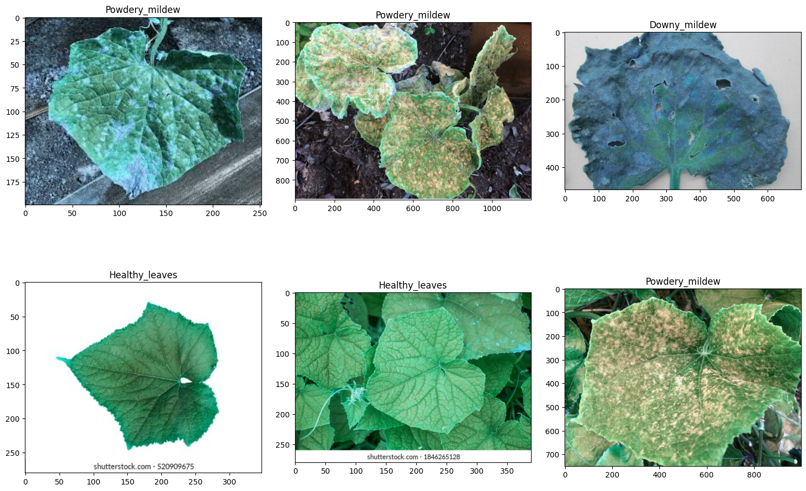
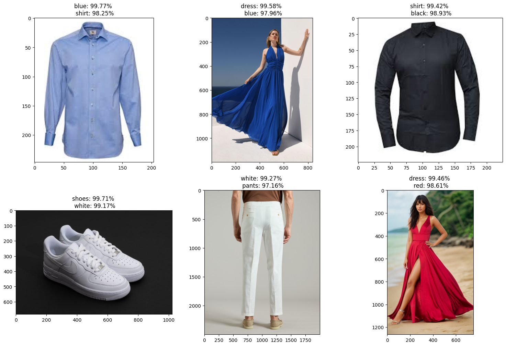

# ACADEMIC BACKGROUND
 * * *
 
### Graduated in Faculty of Applied Sciences (Physical Science) Wayamba University of Sri Lanka. (2020)
- Electronics
- Mathematics & Mathematical Modelling and Statistics
- Computing & Information Systems
  

# WORK EXPERIENCE
* * *

**Associate Machine Learning Engineer @ SilverlineIT | 2024-Oct to Present** 
- Developed the 94% accurate fire alarm detection system was developed for IoT hand band used by disabled workers in a factory.
- Developed automates bill data extraction and enables intelligent querying using AI.

**Training Machine Learning Engineer @ SilverlineIT | 2023-Oct to 2024-Oct**
- Big impacted to develop a safety camera system that detects adults and children while analyzing children's behavior.
- Big impacted to develop a sentiment analysis and automated reply to system for a shopping app.
  
**Electronic and Telecommunication Assistant Engineer @ Browns Engineering & constructions (Pvt) Ltd | 2021 Mar -2022 Nov**
- In my role, I am responsible for managing both active and passive operations within the Dialog Network Service, ensuring continuous, seamless service.| Dialog progect - Progect Mannager |
- I managed the development and implementation of the fiber network in the Central and UVA regions, overseeing the planning, deployment, and optimization of infrastructure to enhance connectivity and network performance | Fiber progect - Assistant Engineer |
  
**Assistan service Engineer @ Geoinformatics International (Pvt) Ltd | 2020 May-2021 Feb**
- I work at a geo survey company where I am responsible for maintaining and servicing all electronic devices and electronic infrastructure. This includes ensuring the functionality, performance, and longevity of equipment used for various surveying and geospatial tasks

# Frameworks and Tools
* * *

# Projects
* * *
## **_SilverlineIT  |  Associate Machine Learning Engineer  |  2024 Oct – Present_** 
### Fire Alarm Detection System for IoT Hand Band   | 2024-2025 | Ongoing Project 
- I developed an intelligent fire alarm detection system designed for IoT bands used by disabled employees in a factory setting. The system ensures accurate emergency response by distinguishing fire alarms from other industrial sounds such as ambulances, fire trucks, and dangerous machinery alerts. This innovation enhances safety by minimizing false alarms and improving real-time hazard detection.
- 

- Technologies Used
  - **Deep Learning Architectures:** Custom CNN models, YAMNet, Wav2Vec
  - **Audio Processing Techniques:** Spectrogram, Mel Spectrogram, MFCCs
  - **Frameworks & Tools:** TensorFlow, PyTorch, FastAPI
  - **Deployment:** AWS Elastic Beanstalk

- Project Impact
  - **High-Accuracy Models:** Developed three custom deep learning models achieving over 93% accuracy, three YAMNet models exceeding 95% accuracy, and a Wav2Vec-based model with a loss rate of less than 10%.
  - **Real-Time Safety Enhancement:** Enables quick and reliable detection of fire alarms to protect disabled employees.
  - **Robust Deployment:** The system was successfully deployed on AWS Elastic Beanstalk for testing, ensuring scalability and real-world applicability.
This end-to-end solution integrates deep learning and IoT to create a safer and smarter factory environment.

### Bill Data Extraction & AI-Powered Query System | 2024 | 
- This project automates the extraction of bill data and enables intelligent querying using AI, streamlining the process of managing and querying invoice and receipt information.
  - **Bill Information Extraction:** Utilizes AWS Textract to automatically extract structured data from invoices and receipts, ensuring accurate and efficient data extraction.
  - **Vector Database Storage:** Stores the extracted information in a vector database, enabling fast and efficient retrieval of bill data based on user queries.
  - **AI-Powered Querying:** Integrates LangChain with an LLM (OpenAI/Gemini or local LLM) to process and answer user queries related to the stored bill data.
  - **Deployment & Delivery:** The system is deployed using AWS Bedrock and AWS Textract to enhance the AI-powered query capabilities and ensure seamless delivery of the project.
 

- Technologies Used:
  - **AWS Textract:** For automated bill data extraction.
  - **LangChain:** For connecting the LLM with the vector database to handle queries.
  - **AWS Bedrock:** To power the AI functionality in the system.
  - **Vector Databases:** To efficiently store and retrieve structured bill data.
  - **FastAPI:** For building a fast, scalable API to interact with the system.
  - **Python:** For scripting and backend development.
    
## **_Silverline IT | Training Machine Learning Engineer | 2023 Oct - 2024 Oct_**
### 	Children and Adults Detection for Safety Camera System | 2024 |
<table cellspacing="0" cellpadding="0"  border="0">
  <tr>
    <td width="75%" align="center">
      
    </td>
    <td width="25%" valign="top">
      Developed an AI-powered safety camera system that detects adults and children in real-time while analyzing children's behavior. 
      The system enhances security by sending instant alerts to parents or guardians, ensuring proactive monitoring in homes, schools, and public spaces. 
      Using state-of-the-art deep learning models, the system accurately identifies individuals and behaviors, reducing safety risks and enabling timely interventions.
    </td>
  </tr>
</table>

- **Technologies Used:** YOLO, DETR, Faster R-CNN, SSD, Computer Vision, Deep Learning.
- **Project Impact:** Designed and developed the detection model, ensuring high accuracy and real-time performance, improving child safety monitoring and parental awareness.
- **Demo project Github Repository:** [Click Here](https://github.com/KaushiML3/Kids_and_Adults_detection-faster-RCNN_yolo_Detr)

### Sentiment Analysis & Automated Reply System for Shopping App |2024|
- Developed an AI-powered sentiment analysis and automated reply system for a shopping app to enhance customer interaction and support. The system analyzes customer feedback in real time, classifies sentiments (positive, neutral, negative), and triggers automated responses based on sentiment categories. By leveraging a fine-tuned DistilBERT model, the system ensures high accuracy in understanding customer emotions and delivering relevant responses. This solution improves customer satisfaction, reduces response time, and optimizes customer engagement.

- **sentiment analysis DistilBERT model demo**

- Technologies Used
  - **DistilBERT:** Lightweight transformer-based model for sentiment classification
  - **LoRA (Low-Rank Adaptation):** Efficient fine-tuning technique for optimizing DistilBERT
  - **Hugging Face Transformers:** Model training, fine-tuning, and deployment
  - **NLP (Natural Language Processing):** Text analysis and sentiment detection
  - **Python:** Backend implementation and integration
  - **FastAPI:** Lightweight API framework for deploying sentiment analysis and automated responses

- Project Impact
  - Fine-tuned the DistilBERT model using LoRA, improving sentiment classification accuracy with efficient parameter updates.
  - Optimized real-time sentiment detection, enabling instant automated responses to customer feedback.
   
- **Demo project Github Repository:** [Click Here](https://github.com/KaushiML3/Fine-tuning-a-LLM-for-sentiment-analysis)
- **Demo project Hugging face space:** [Click Here](https://huggingface.co/spaces/KaushiGihan/distilbert-base-uncased-sentiment_analysis_LLM)
    
## Personal and R&D projects
### Computer vision 

#### cucumber leaf diseases classification

- Cucumber leaves are susceptible to various diseases, primarily fungal and bacterial. Common issues include powdery mildew, which forms white, powdery spots on leaves, and downy mildew, characterized by yellow patches and a fuzzy underside. Anthracnose causes dark, sunken spots on leaves and fruit, while angular leaf spot results in water-soaked lesions that become angular and brown.Bacterial wilt, spread by cucumber beetles, causes leaves to wilt and die. Proper spacing, crop rotation, and the use of resistant varieties can help manage these diseases, along with timely fungicide or bactericide applications.
  

  
- Technologies Used
  - **Custom CNN Architecture** – Designed a specialized deep learning model for disease classification
  - **VGG16 :** Leveraged a pre-trained model for feature extraction and enhanced accuracy
  - **Computer Vision:**  Image processing for disease identification
  - **Deep Learning (TensorFlow/Keras):**  Training and fine-tuning the model for classification
    
Developed a custom architecture and fine-tuned VGG16, improving disease detection accuracy.Enabled early disease identification, helping farmers take preventive action and reduce crop loss.

- **Github Repository:**[Click Here](https://github.com/KaushiML3/Cucumber-Leaf-Disease-Classification-CNN-VGG16-VIT/tree/main)

#### Multilabel Classification CNN and Vision-Transformer 

<table cellspacing="0" cellpadding="0"  border="0">
  <tr>
    <td width="50%" align="center">
      
    </td>
    <td width="50%" valign="top">
              This repository implements an Image Multi-Label Classification model, which can identify multiple labels in a single image. Unlike traditional image                         classification, where an image is assigned a single category, multi-label classification allows an image to have multiple labels simultaneously.
     <b> </b>
     <b>GitHub Repository:</b> <a href="https://github.com/KaushiML3/Cucumber-Leaf-Disease-Classification-CNN-VGG16-VIT/tree/main" target="_blank">Click Here</a>
    </td>

   
  </tr>
</table>

#### Tranfer Learning - Vision Transformer: 

- Vision Transformers (ViTs) are a type of neural network architecture designed primarily for processing images. Unlike traditional convolutional neural networks (CNNs), which process images in a hierarchical manner, ViTs apply self-attention mechanisms to capture global dependencies between image patches. This allows them to achieve strong performance on various computer vision tasks without relying on convolutional layers. ViTs have gained popularity for their ability to handle long-range dependencies effectively, making them suitable for tasks like image classification, object detection, and segmentation. The original Vision Transformer developed by Google. It divides images into patches, processes them as tokens, and applies transformer layers.This repository include how to fine tune the vision transformer model.
- **Github Repository:**[Click Here](https://github.com/KaushiML3/Vision_Transformer_Transfer_Learning)

### Natural Language Processing
#### Simple NLP projects
- **Language Detection:** A model that identifies the language of a given text, enabling automated localization and multilingual processing.
- **Spam Message Detection:** A system that classifies messages as spam or not, helping to filter unwanted content and improve communication efficiency.
- **Suspicious URL Detection:** A model that detects malicious or suspicious URLs, enhancing security by identifying potential phishing attempts or harmful websites.
- **Obfuscated JavaScript Detection:** A tool to analyze and detect obfuscated JavaScript code, helping to identify potentially malicious scripts in web applications.

  

- **Github Repository:**[Click Here](https://github.com/KaushiML3/Simple-NLP-projects/tree/main)
- **Hugging face space:**[Click Here](https://huggingface.co/spaces/KaushiGihan/simple_language_and_spam_message_detection)

#### Transformer Language translation 
-This repository contains a Transformer-based language translation model trained to translate Portuguese to English. The implementation follows a simplified approach using TensorFlow/Keras and includes a Jupyter Notebook demonstrating training on a small dataset for quick experimentation
- **Github Repository:**[Click Here](https://github.com/KaushiML3/Transformer_Language-translation)

### Audio and other
#### Numerical audio authentication system Deep learning.
