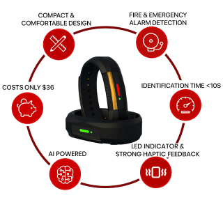

## ACADEMIC BACKGROUND
 * * *
 
#### Graduated in Faculty of Applied Sciences (Physical Science) Wayamba University of Sri Lanka. (2020)
- Electronics
- Mathematics & Mathematical Modelling and Statistics
- Computing & Information Systems
  

## WORK EXPERIENCE
* * *

**Associate Machine Learning Engineer @ SilverlineIT | 2024-Oct to Present**
- Developed the 94% accurate fire alarm detection system was developed for IoT hand band used by disabled workers in a factory.
- Developed automates bill data extraction and enables intelligent querying using AI.

**Training Machine Learning Engineer @ SilverlineIT | 2024-Oct to Present**
- Big impacted to develop a safety camera system that detects adults and children while analyzing children's behavior.
- Big impacted to develop a sentiment analysis and automated reply to system for a shopping app.
  
**Browns Engineering & constructions (Pvt) Ltd | Electronic and Telecommunication Assistant Engineer | 2021 Mar -2022 Nov**
- In my role, I am responsible for managing both active and passive operations within the Dialog Network Service, ensuring continuous, seamless service.| Dialog progect - Progect Mannager |
- I managed the development and implementation of the fiber network in the Central and UVA regions, overseeing the planning, deployment, and optimization of infrastructure to enhance connectivity and network performance | Fiber progect - Assistant Engineer |
  
**Geoinformatics International (Pvt) Ltd	 | Assistan service Engineer | 2020 May-2021 Feb**
- I work at a geo survey company where I am responsible for maintaining and servicing all electronic devices and electronic infrastructure. This includes ensuring the functionality, performance, and longevity of equipment used for various surveying and geospatial tasks

## Frameworks and Tools
* * *

## Projects
* * *
### **_SilverlineIT  |  Associate Machine Learning Engineer  |  2024 Oct – Present_**
#### Fire Alarm Detection System for IoT Hand Band   | 2024-2025 | Ongoing Project
- I developed an intelligent fire alarm detection system designed for IoT bands used by disabled employees in a factory setting. The system ensures accurate emergency response by distinguishing fire alarms from other industrial sounds such as ambulances, fire trucks, and dangerous machinery alerts. This innovation enhances safety by minimizing false alarms and improving real-time hazard detection.
- 

- Technologies Used
  - **Deep Learning Architectures:** Custom CNN models, YAMNet, Wav2Vec
  - **Audio Processing Techniques:** Spectrogram, Mel Spectrogram, MFCCs
  - **Frameworks & Tools:** TensorFlow, PyTorch, FastAPI
  - **Deployment:** AWS Elastic Beanstalk

- Project Impact
  - **High-Accuracy Models:** Developed three custom deep learning models achieving over 93% accuracy, three YAMNet models exceeding 95% accuracy, and a Wav2Vec-based model with a loss rate of less than 10%.
  - **Real-Time Safety Enhancement:** Enables quick and reliable detection of fire alarms to protect disabled employees.
  - **Robust Deployment:** The system was successfully deployed on AWS Elastic Beanstalk for testing, ensuring scalability and real-world applicability.
This end-to-end solution integrates deep learning and IoT to create a safer and smarter factory environment.

#### Bill Data Extraction & AI-Powered Query System | 2024| 
- This project automates the extraction of bill data and enables intelligent querying using AI, streamlining the process of managing and querying invoice and receipt information.
  - **Bill Information Extraction:** Utilizes AWS Textract to automatically extract structured data from invoices and receipts, ensuring accurate and efficient data extraction.
  - **Vector Database Storage:** Stores the extracted information in a vector database, enabling fast and efficient retrieval of bill data based on user queries.
  - **AI-Powered Querying:** Integrates LangChain with an LLM (OpenAI/Gemini or local LLM) to process and answer user queries related to the stored bill data.
  - **Deployment & Delivery:** The system is deployed using AWS Bedrock and AWS Textract to enhance the AI-powered query capabilities and ensure seamless delivery of the project.
 

- Technologies Used:
  - **AWS Textract:** For automated bill data extraction.
  - **LangChain:** For connecting the LLM with the vector database to handle queries.
  - **AWS Bedrock:** To power the AI functionality in the system.
  - **Vector Databases:** To efficiently store and retrieve structured bill data.
  - **FastAPI:** For building a fast, scalable API to interact with the system.
  - **Python:** For scripting and backend development.
