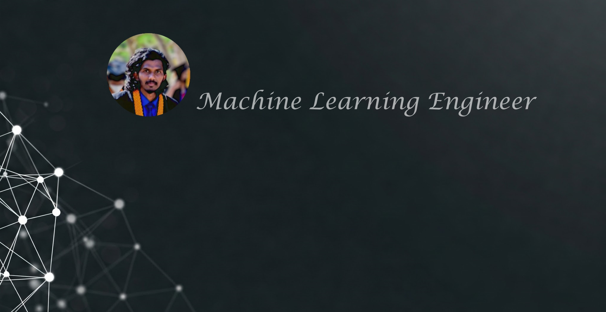

## ACADEMIC BACKGROUND
#### Graduated in Faculty of Applied Sciences (Physical Science) Wayamba University of Sri Lanka. (2020)
- Electronics
- Mathematics & Mathematical Modelling and Statistics
- Computing & Information Systems
  

## WORK EXPERIENCE
**Associate Machine Learning Engineer @ SilverlineIT | 2024-Oct to Present**
- Developed the 94% accurate fire alarm detection system was developed for IoT hand band used by disabled workers in a factory.
- Developed automates bill data extraction and enables intelligent querying using AI.

**Training Machine Learning Engineer @ SilverlineIT | 2024-Oct to Present**
- Big impacted to develop a safety camera system that detects adults and children while analyzing children's behavior.
- Big impacted to develop a sentiment analysis and automated reply to system for a shopping app.

## Frameworks and Tools

## Projects

### Fire Alarm Detection System for IoT Hand Band   | 2024-2025 | Ongoing Project
- I developed an intelligent fire alarm detection system designed for IoT bands used by disabled employees in a factory setting. The system ensures accurate emergency response by distinguishing fire alarms from other industrial sounds such as ambulances, fire trucks, and dangerous machinery alerts. This innovation enhances safety by minimizing false alarms and improving real-time hazard detection.

- Technologies Used
  
  - **Deep Learning Architectures:** Custom CNN models, YAMNet, Wav2Vec
  - **Audio Processing Techniques:** Spectrogram, Mel Spectrogram, MFCCs
  - **Frameworks & Tools:** TensorFlow, PyTorch, FastAPI
  - **Deployment:** AWS Elastic Beanstalk

- Project Impact
1. **High-Accuracy Models:** Developed three custom deep learning models achieving over 93% accuracy, three YAMNet models exceeding 95% accuracy, and a Wav2Vec-based model with a loss rate of less than 10%.
2. **Real-Time Safety Enhancement:** Enables quick and reliable detection of fire alarms to protect disabled employees.
3. **Robust Deployment:** The system was successfully deployed on AWS Elastic Beanstalk for testing, ensuring scalability and real-world applicability.
This end-to-end solution integrates deep learning and IoT to create a safer and smarter factory environment.

